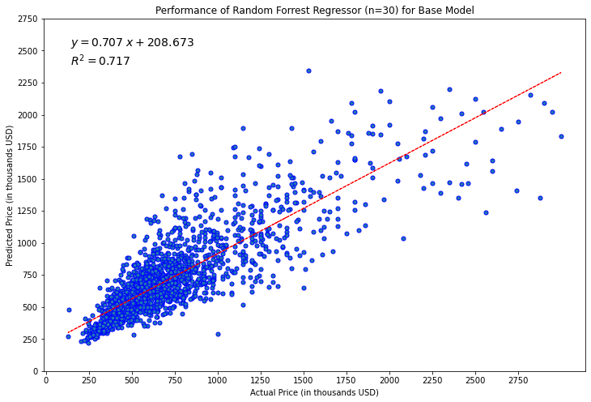

# Overview

Check [this](README.md) for the introduction of the project. 

# Machine Learning Model Results

To predict the price of a house based on factors, we ran two different *supervised ML models* in three different stages. In the first stage, a *base* model consisting of only the attributes of the house was used. In the second stage, school ratings enrichment data was added. Finally, demographics (per zip code) enrichment datw was added. 80% of the data was used for training and 20% was used for testing in each case. The table below shows the *meansquare error* (MSE), and the R2 coefficient showing the model's accuracy.

| Model | MSE (Multiplied by 109 | R2 Training | R2 Testing |
| ----- | --------------------------------- | ---------------------- | --------------------- |
| Multiple Linear Regression (Base) | 55.09 | 0.67 | 0.66 |
| Random Forrest, n=30 (Base) | 45.5 | 0.96 | 0.72 |
| Multiple Linear Regression (School Ratings) | 38.13 | 0.76 | 0.76 |
| Random Forrest, n=30 (School Ratings) | 18.61 | 0.98 | 0.88 |
| Multiple Linear Regression (All Enrichment) | 35.12 | 0.78 | 0.78 |
| Random Forrest, n=30 (All Enrichment) | 16.1 | 0.98 | 0.9 |

## Results Explanation

* The accuracy of the base model for the test data topped out at R2 value of 0.72. On its own merit, this is an acceptable result. The figure below shows the graph of actual versus predicted price to corroborate this finding.

* However, when the school ratings enrichment data is added, the testing data R2 accuracy improved to a very high 0.88. The MSE also reduced from 55.09 to 18.61, an almost 67% reduction. This shows the school ratings are an important predictor for the sales price of a house. The graph of the actual versus predicted prices below looks more tidy now.

* In the final phase, demographics data was added summarized as ethnic breakdown per zip code. This slightly improved the model accuracy as shown in the picture below and the values in the table above.

* We plotted the percentage deviation of the predicted price versus the actual sales price. The graph below shows that the percent deviation *does not* depend upon the actual price. This is good, because our model can be confidently used to predict the price of a house at any value.

## Important Predictors

From the *all enrichments* model, the picture below shows the most important predictors found by the Random Forrest model. We can see that nearly 65% of the sales price is explained essentially by the top two predictors:

* Percent AA population
* Living Area

Previously, we discussed the fact the school rating seemed a very important predictor for the sales price. It turns out that school rating is highly correlated with the percent AA population. If we instead look at the model with only the school ratings enrichment data, the *high school ratings* data is indeed a top two predictor accounting for over 30% of the model's prediction.

Another way to look at the predictors is to check the multiple linear regression model that gives us *coefficients* for the dependent variables. In the table below, the most important coefficients are noted.

| Predictor | Coefficient | Explanation |
| --------- | ----------- | ----------- |
| bathrooms | 72243 | Adding one bathroom increased the sale price by $72K |
| livingArea | 126 | Increasing the living area by 1 sqft increased the sale price by $126 - this can be interpreted as the average sqft price |
| highRating | 55435 | Increasing high school rating by 1 point (on a scale of 1-10) increased the home price by $55K |

The multiple linear regression model had a very large negative constant (-396K) making the interpretation of some other coefficients difficult.

Overall, a majority of the predictors we collectively chose for predicting the sale price turned out to be accurate. Below, we show three different scatterplots showing the price variation for three important predictors for our model.

| Predictor | Scatterplot |
| --------- | ----------- |
| Living Area |  |
| High School Rating |  |
| Number of Bathrooms |  |

# Conclusion

A Random Forrest Regressor model with about 10 features is enough to predict the sale price of a house in the Montgomery County, MD with an accuracy of 90%. The graph below shows how the R2 of the test data saturates at around 10 features. 

The most important predictors are:
* Living Area
* High School rating (or Ethnic breakdown, as these two are correlated)
* Number of Bathrooms
* Age of the House

